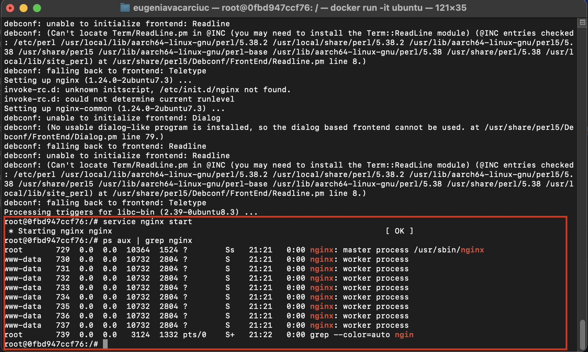

Task 1 - Linux Essentials

-> Main goal:

In this task, I worked inside a Docker container that runs Ubuntu.  

I used simple Linux tools to:
- check the IP address of a website
- map an IP to a custom name
- test if a DNS port is open
- change the DNS settings
- install and run a web server (Nginx)
- make some basic changes to Nginx

-> Environment setup:
- started an ubuntu container using ```bash
  docker run -it ubuntu
- installed the following tools:
  apt update && apt install -y dnsutils iputils-ping net-tools netcat-openbsd 

   Why I installed them:
	After reading the task carefully, I identified the tools I would need and installed them before starting.Below is a short explanation of each package and the step where I used it:
            - `dnsutils` – used in Step 1 and Step 4, with the `dig` command, to perform DNS lookups for `cloudflare.com`.
            - `iputils-ping` – used in Step 2, when I tested if the hostname `google-dns` resolved correctly and responded to ping requests.
            - `net-tools` – used in Step 6, with the `netstat` command, to check which port nginx was listening on.
            - `netcat` (`nc`) – used in Step 3, to check if DNS port `53` was open and reachable on `google-dns` (IP `8.8.8.8`).

    Installing these tools at the beginning helped me complete each step of the task efficiently inside the Ubuntu container.

-> What I did – Step by Step
    
    Step 1: Find the IP address of cloudflare.com
        - To find the IP address of a website, I used the `dig` command.This command asks the DNS server: "What is the IP of cloudflare.com?" and shows the result.I added `+short` to the command to only get the IP address.
    
        - Command I used: dig +short cloudflare.com 
        
        - Why i did this: to check if the container can connect to a DNS server and to make sure i can resolve website names to IP addresses.
        
        - What I got:
            104.16.133.229
            104.16.132.229
        
        - 

    Step 2: Map IP address 8.8.8.8 to hostname google-dns
    
        - In this step,I told the system that the name `google-dns` should point to the IP address `8.8.8.8`.This is done by adding a line to a special file called `/etc/hosts`.This file acts like a small address book for the system. It says: "If you see this name, use this IP address."

        - Command I used: echo "8.8.8.8 google-dns" >> /etc/hosts
        
        - Why i did this: to simulate custom hostname resolution without using DNS and to make the name google-dns usable in the next steps.
        
        - How I checked if it worked: 
            I used ping to test the new hostname: ping -c 2 google-dns
        
        - What I got: 
                PING google-dns (8.8.8.8) 56(84) bytes of data.
                64 bytes from google-dns (8.8.8.8): icmp_seq=1 ttl=63 time=25.3 ms
                64 bytes from google-dns (8.8.8.8): icmp_seq=2 ttl=63 time=21.7 ms

                --- google-dns ping statistics ---
                2 packets transmitted, 2 received, 0% packet loss, time 1007ms
                rtt min/avg/max/mdev = 21.698/23.475/25.253/1.777 ms
        - 
            
    Step 3: Check if the DNS Port is Open for google-dns
        - Now that `google-dns` points to `8.8.8.8`, I wanted to check if that IP has the DNS service running.DNS servers usually listen on port 53.To check if this port is open and accepting connections, I used a tool called `netcat` (`nc`).
            
        - Command I used: nc -zv google-dns 53 
        
        - What I got: Connection to google-dns (8.8.8.8) 53 port [tcp/*] succeeded! (this message means that port 53 is open, and the DNS service is working at that IP).
        
        - 
        
    Step 4: Change the system DNS to 8.8.8.8
        - In this step, I wanted to tell the system to use Google’s public DNS server (`8.8.8.8`) instead of the default one.Linux uses the file called `/etc/resolv.conf` to know which DNS server to use when looking up website names and I changed this file to point to Google's DNS server insetad of the default Docker DNS.
        
        - What was in the file before: when I first opened `/etc/resolv.conf`, it looked like this: nameserver 192.168.65.7 (the default local DNS server used by Docker).
        
        - Command I used: echo "nameserver 8.8.8.8" > /etc/resolv.conf
        
        - What I got: nameserver 8.8.8.8
        
        - Before and after `/etc/resolv.conf`:
          
        
        - How I tested it: i ran the same command as in step 1 to look up the IP of cloudflare.com - dig +short cloudflare.com
        
        - What I got:
            104.16.133.229
            104.16.132.229
            
        - Comparison: 
            * before changing DNS:
                104.16.133.229
                104.16.132.229
            * after changing DNS:
                104.16.133.229
                104.16.132.229
                
            -> The IP addresses are the same.The key difference is who provided the answer: before,it was Docker’s local DNS server (192.168.65.7), and after,it was Google’s DNS server (8.8.8.8). This shows that the system now successfully uses Google DNS.
            
            - DNS lookup after DNS change:
            

        
    Step 5: Install and verify that Nginx service is running
        - In this step, I installed and started a web server called Nginx.Nginx is a popular web server that can show web pages or handle internet traffic.
        
        - Command I used: apt update && apt install -y nginx
        
        - Then I started the server with : service nginx start
        
        - 
        
        - What I got : * Starting nginx nginx (the server was successfully started)

        - How I checked that it nginx is running: ps aux | grep nginx 
        
        
        
        - What I got: 
          root       729  0.0  0.0  10364  1524 ?        Ss   21:21   0:00 nginx: master process /usr/sbin/nginx
        www-data   730  0.0  0.0  10732  2804 ?        S    21:21   0:00 nginx: worker process
        www-data   731  0.0  0.0  10732  2804 ?        S    21:21   0:00 nginx: worker process
        www-data   732  0.0  0.0  10732  2804 ?        S    21:21   0:00 nginx: worker process
        www-data   733  0.0  0.0  10732  2804 ?        S    21:21   0:00 nginx: worker process
        www-data   734  0.0  0.0  10732  2804 ?        S    21:21   0:00 nginx: worker process
        www-data   735  0.0  0.0  10732  2804 ?        S    21:21   0:00 nginx: worker process
        www-data   736  0.0  0.0  10732  2804 ?        S    21:21   0:00 nginx: worker process
        www-data   737  0.0  0.0  10732  2804 ?        S    21:21   0:00 nginx: worker process
        root       739  0.0  0.0   3124  1332 pts/0    S+   21:22   0:00 grep --color=auto ngin
                
        * The master process is running as root
        * Several worker processes are running under www-data.
        
        - I also checked the service status : service nginx status (this confirmed me that nginx was active and running.)
        
        
        
    Step 6: Find the Listening Port for Nginx
        - After I installed and started Nginx, I wanted to check which port it was using to listen for incoming connections.By default, Nginx listens on port 80, which is the standard port for HTTP websites.
        
        - Command I used: netstat -tulpn | grep nginx (this command checks all open ports and filters the output to show only lines related to Nginx.)
            t – show TCP connections
            u – show UDP (not relevant for Nginx)
            l – show only listening ports
            p – show the process name and PID
            n – show IPs and ports as numbers
        
        - What I got: 
            tcp        0      0 0.0.0.0:80              0.0.0.0:*               LISTEN      729/nginx: master p 
            tcp6       0      0 :::80                   :::*                    LISTEN      729/nginx: master p 
        * The first line shows that Nginx is listening on port 80 for IPv4 connections from any IP (0.0.0.0).
        * The second line shows that Nginx is also listening on port 80 for IPv6 connections (::: means all IPv6 addresses).
        * This confirms that Nginx is running and is correctly listening on the default HTTP port.
        
        
        
    Bonus: Change the Nginx listening port to 8080
    
      - By default, Nginx listens on port 80.As part of the bonus task, I changed it to port 8080.
      - Why change the port?
            Changing the port helps to test how Nginx behaves on different ports, avoids conflicts if something else is using port 80 and simulate custom setups used in real-world environments.
     - How i did that: 
        * I edited the default Nginx configuration file using the following command:  nano /etc/nginx/sites-available/default
        * Then I changed these lines:

        server {
                listen 80 default_server;
                listen [::]:80 default_server;
        To:
        
        server {
                listen 8080 default_server;
                listen [::]:8080 default_server;
                
        
        
                
        * Then I restarted Nginx using - service nginx restart
        
        * What I got:  * Restarting nginx nginx           
        
        * How I checked if it worked: i ran the same command as before: netstat -tulpn | grep nginx
        
        * What I got: 
            tcp        0      0 0.0.0.0:8080            0.0.0.0:*               LISTEN      771/nginx: master p 
            tcp6       0      0 :::8080                 :::*                    LISTEN      771/nginx: master p 

        (this confirms that Nginx is now listening on port 8080 for both IPv4 and IPv6 connections.)
        
         
        
    Bonus: Change the default HTML page title in Nginx
    
        - As the second part of the bonus, I changed the title of the default Nginx web page.By default, when you open the page served by Nginx in a browser, it shows the title:

            <title>Welcome to nginx!</title>
        - I changed it to a custom message to show that I completed the Linux part of the task.
        
        - How I did it:
            - I opened the default Nginx HTML file using the following command: nano /var/www/html/index.nginx-debian.html
            - Then I looked for this line: <title>Welcome to nginx!</title> and I changed it to: <title>I have completed the Linux part of the DevOps internship project</title>
        - How i tested it:  
            I used curl to see what the page returns: curl -s http://localhost:8080 | grep "<title>"
        - What I got : <title>I have completed the Linux part of the DevOps internship project</title>
        
        -
        


        

        


