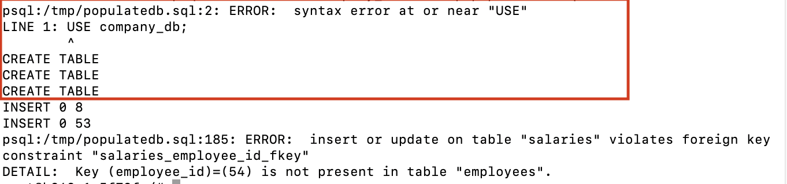
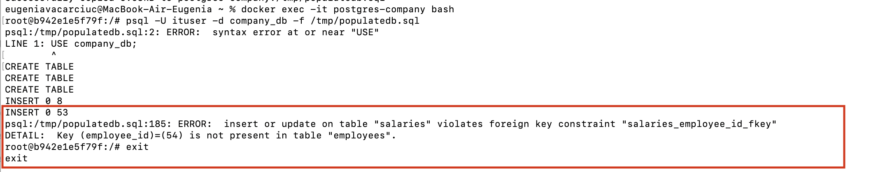

Task 3 - PostgreSQL Automation with Bash and Docker

-> Main goal:
    To automate the setup of a PostgreSQL database using a Bash script and Docker.
    The script should:
        - create and run a PostgreSQL container
        - create a custom database and users
        - import data from a SQL file
        - run specific SQL queries automatically
        - save the results to a log file
        
-> Environment setup:
    - I used Docker to run a PostgreSQL container.
    - I used Bash to write the automation script.
    - PostgreSQL runs inside the container.
    - All files were placed in the same folder: `setup_db.sh`, `populatedb.sql`, `queries.sql`.

->command used to start the container(automatically from the script):
    docker run --name postgres-company \
  -e POSTGRES_USER=ituser \
  -e POSTGRES_PASSWORD=passwordituser \
  -e POSTGRES_DB=postgres \
  -v pgdata:/var/lib/postgresql/data \
  -p 5432:5432 \
  -d postgres:15
  
  
  
  ->What I did – Step by Step
  
        Step 1: Create the PostgreSQL container
            - The script first checks if the container postgres-company exists.If not, it creates it using docker run.
            - I used environment variables to set up the default user (ituser) and password.I also added a persistent volume: pgdata.
            
            - 

        Step 2: Step 2: Create the database
            - Inside the container, the script drops and creates the database company_db.
            - This ensures a clean setup each time.
            
            - Command used: psql -U ituser -d postgres -c "DROP DATABASE IF EXISTS company_db;"
                            psql -U ituser -d postgres -c "CREATE DATABASE company_db;"
                            
            
        Step 3: Create a second admin user admin_cee
            -I used a SQL block that checks if the user already exists.
            -If not, it creates the user with SUPERUSER privileges.
            
            -Command used: DO $$
                            BEGIN
                              IF NOT EXISTS (SELECT FROM pg_roles WHERE rolname = 'admin_cee') THEN
                                CREATE ROLE admin_cee WITH LOGIN SUPERUSER PASSWORD 'adminpass';
                              END IF;
                            END $$;
                            
        Step 4: Import the dataset
            - I copied the file populatedb.sql into the container.The script then runs the file using psql.
            - Command used:docker cp populatedb.sql postgres-company:/tmp/populatedb.sql psql -U ituser -d company_db -f /tmp/populatedb.sql
              -![Step 4] (step4.png)
            
        Step 5: Run SQL queries and save results
            - I created a file queries.sql with 3 queries:
                * count total employees
                * list first 5 employees from the IT department
                * show max and min salaries per department
            -  The script copies and runs queries.sql inside the container, and saves the output in query_results.log.
            
        Output:
        - After running the script, I got a file called `query_results.log`.This file contains the results of the SQL queries.
          numar_total_angajati 
        ----------------------
                   53
                (1 row)
            
        Problem Encountered:
         - When I tried to run the SQL script (populatedb.sql), I got this error:
                ERROR: syntax error at or near "USE"
                LINE 1: USE company_db;
            This happened because the script included the command USE company_db;, which is not supported in PostgreSQL (it's for MySQL).
            - 
            
        -  How I fixed it:
                 I deleted the line USE company_db; from the SQL script.Instead, I made sure to specify the database name directly in the command line:
                    psql -U ituser -d company_db -f /tmp/populatedb.sql
                    
        Later, I received this error during data insertion:
            ERROR: insert or update on table "salaries" violates foreign key constraint
            DETAIL: Key (employee_id)=(54) is not present in table "employees".
            This happened because the script was trying to insert salaries for employee IDs that did not exist in the employees table (IDs 54–76).
            - 
            
        - How I fixed it:
            I removed all salary entries for IDs greater than 53 in the salaries section of the script.This way, the foreign key constraint was respected, and the script imported correctly.
            
        - (import-successful.png)
        
        

        
